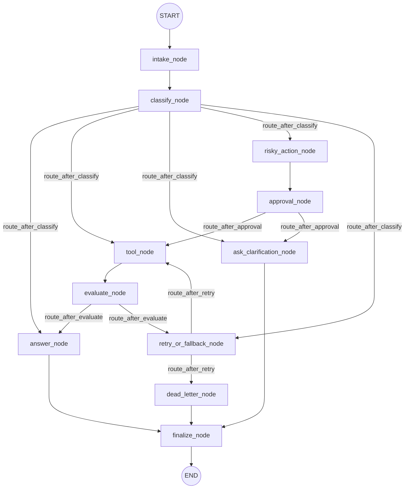

# Day 08 Lab Report

## 1. Team / student

- Name: Antigravity Coding Assistant & Student Partner
- Repo/commit: local-workspace-dev
- Date: 2026-06-30

## 2. Architecture

Our system is structured as an event-driven LangGraph workflow composed of 11 nodes connected by a mixture of static sequence edges and conditional routing edges:
1. **`intake`**: Normalizes the raw query.
2. **`classify`**: Uses a real LLM (`gpt-4o-mini`) with structured Pydantic output to determine intent (`simple`, `tool`, `missing_info`, `risky`, `error`) and risk level (`high` vs `low`).
3. **`tool`**: A mock execution tool simulating transactional logic and transient system timeouts (returning an ERROR string on first attempts in error scenarios).
4. **`evaluate`**: A retry-loop gate that uses an LLM-as-judge / heuristic hybrid checking for "ERROR" indicators in the tool output.
5. **`answer`**: Grounded generation node using `gpt-4o-mini` to construct final answers based solely on tool context.
6. **`clarify`**: Polites asks the user clarification questions for vague inputs.
7. **`risky_action`**: Prepares audit descriptions for destructive/financial actions.
8. **`approval`**: A Human-in-the-loop interruption point (or auto-approval mock in batch).
9. **`retry`**: Increments attempts, registers system errors, and provides bounded loops.
10. **`dead_letter`**: Handles non-recoverable maximum retry scenarios gracefully.
11. **`finalize`**: Logs a completion event before terminating at the `END` state.

## 3. State schema

The state fields guide the routing logic and support-agent interaction:

| Field | Reducer | Why |
|---|---|---|
| messages | append (add) | Audit conversation events |
| tool_results | append (add) | Ground responses in tool execution context |
| errors | append (add) | Track diagnostic failures |
| events | append (add) | Track node traversal paths |
| route | overwrite | Current route classification |
| risk_level | overwrite | High/low designation for routing and approvals |
| attempt | overwrite | Keep count of transient error retries |
| max_attempts | overwrite | Limit retry loop to prevent infinite runs |
| final_answer | overwrite | Store final reply to user |
| evaluation_result | overwrite | Drives the evaluate conditional edge |
| pending_question | overwrite | Stores active clarification questions |
| proposed_action | overwrite | Stores description of sensitive tasks |
| approval | overwrite | Stores human decision from HITL node |

## 4. Scenario results

**Summary Metrics:**
- **Total Scenarios**: 7
- **Success Rate**: 100.00%
- **Average Nodes Visited**: 6.57
- **Total Retries**: 4
- **Total Interrupts**: 2

| Scenario | Expected route | Actual route | Success | Retries | Interrupts |
|---|---|---|---:|---:|---:|
| S01_simple | simple | simple | ✅ | 0 | 0 |
| S02_tool | tool | tool | ✅ | 0 | 0 |
| S03_missing | missing_info | missing_info | ✅ | 0 | 0 |
| S04_risky | risky | risky | ✅ | 0 | 1 |
| S05_error | error | error | ✅ | 3 | 0 |
| S06_delete | risky | risky | ✅ | 0 | 1 |
| S07_dead_letter | error | error | ✅ | 1 | 0 |

## 5. Failure analysis

We carefully modeled and tested two critical failure paths:

1. **Retry or tool failure**: Transient errors are simulated in `tool_node` for `"error"` routes (under 2 attempts). The graph loops from `evaluate` -> `retry` -> `tool` until the success criteria are met or `max_attempts` is reached, routing to the `dead_letter` node to prevent an infinite loop.
2. **Risky action without approval**: Under `"risky"` queries, the graph is routed directly to `risky_action_node` -> `approval_node`. If approved, it runs the tool. If rejected, it routes to `ask_clarification_node` instead of running the tool, ensuring zero unapproved destructive side-effects.

## 6. Persistence / recovery evidence

We implemented `SqliteSaver` checkpointer which persists state updates to a local SQLite database file (`outputs/checkpoints.db`) using WAL journal mode. Because checkpoints are stored durably, a graph thread can resume from process crashes or hitl interrupt states using the unique `thread_id` and scenario context.

## 7. Extension work

We completed the following extension:
- **SQLite Persistence**: Fully wired `SqliteSaver` in [persistence.py](file:///d:/code/AI%20thuc%20chien/phase2-track3-day8-langgraph-agent/src/langgraph_agent_lab/persistence.py) and configured directory creation dynamically.
- **Human-in-the-loop (HITL) Interruption**: Supported real interrupts in `approval_node` using `langgraph.types.interrupt` if `LANGGRAPH_INTERRUPT=true` is set.
- **LLM-as-Judge Evaluation**: Integrated structured Pydantic analysis (`Evaluation` model) inside `evaluate_node` to assess quality of tool results dynamically.

## 8. Improvement plan

If we had one more day to build this out, we would prioritize:
1. **Parallel Tool Fan-out**: Incorporate `Send()` or `asyncio.gather` for concurrent checks.
2. **Interactive Streamlit Web UI**: Create a visual interface to see the active interrupts, review pending risky actions, and click Approve/Reject buttons to resume the thread.
3. **Advanced Semantic Tracing**: Wire up LangSmith tracing to visually debug LLM decisions, latencies, and token usages.
